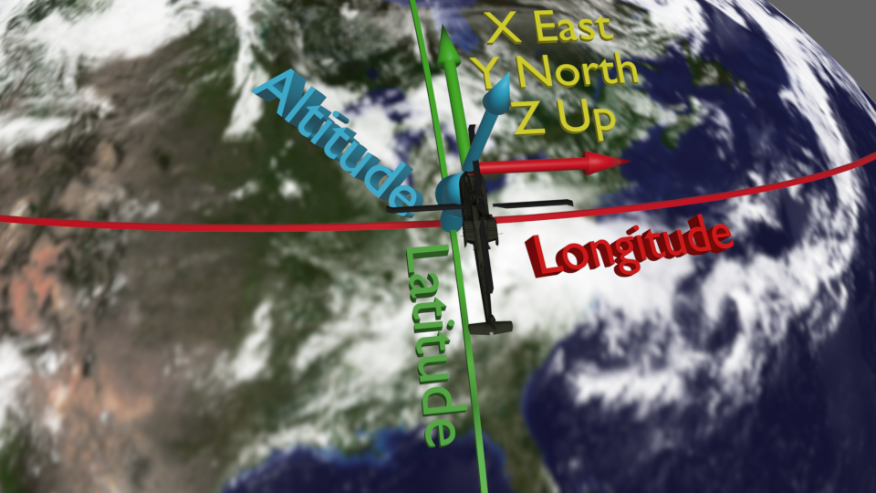
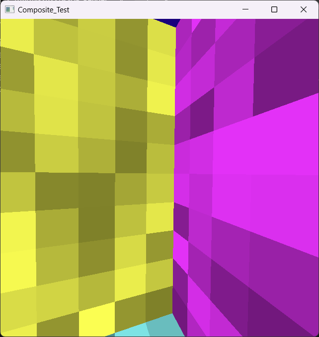
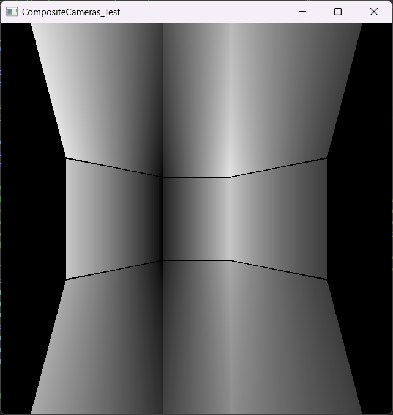
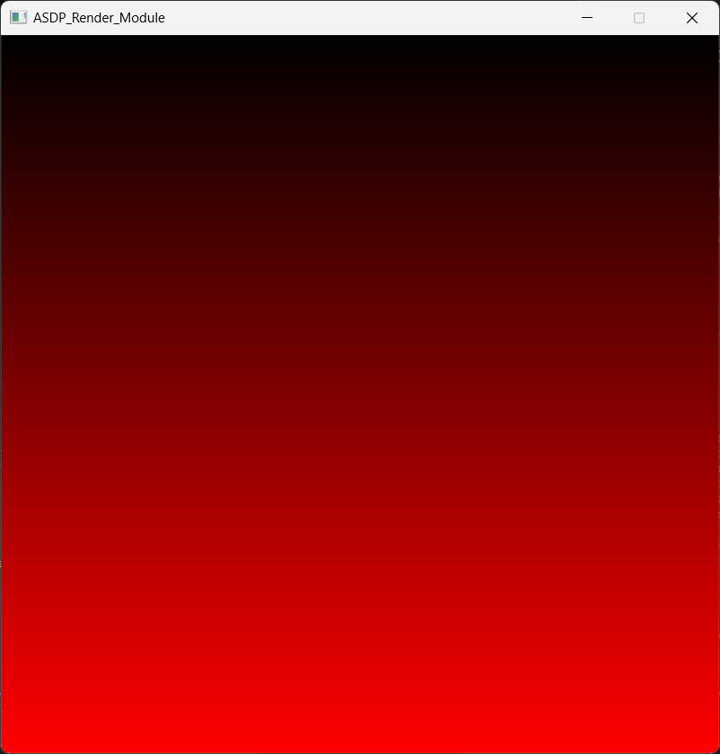
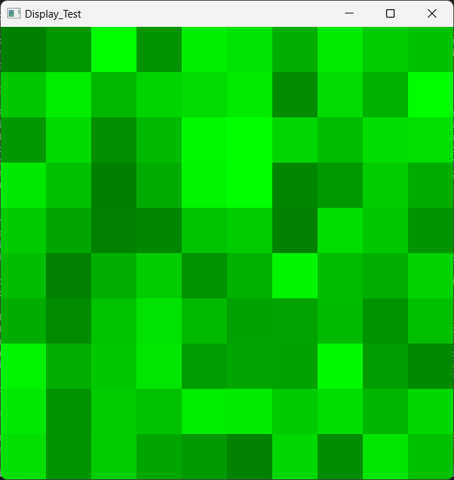

# ASDP_Render_Module

This repository contains the source code for a Render Module 
for the Apache Strap-Down Pilotage program.

## Getting Started

This Render module must be cloned recursively so that it pulls in all of its submodules:
`git clone --recursive https://github.com/arizonaCameraLab/ASDP_Render_Module`

**Summary:** Quick instructions to get set up on Linux for Storage and Render Server systems
(replace X with the serial number of the systems being used [1-4] in the IP addresses):

- Storage Server:
    - Build and install ASDP_Core_API, ASDP_Core_Module, and ASDP_Camera_Simulator (in that order).
    - ASDP_Core_Module 10.10.10.X1 --verbosity 100
- Render Server:
    - Build and install ASDP_Core_API and ASDP_Render_Module (in that order).
    - cd /usr/local/bin/ASDP_Render_Module_Configs; sudo cp 0_21cam.json 0.json
    - ASDP_Render_Module 10.10.10.X2

**Detailed requirements:** The ASDP_Render_Module requires the ASDP_Core_API library to have been
installed before it is built.  This installs by default in a known system location that can
be found automatically.  The library source can be obtained using:
`git clone https://github.com/arizonaCameraLab/ASDP_Core_API` and instructions in the
repository tell how to install it.

The following packages are required (apt install) to build on Linux:
- libglfw3-dev
- libglew-dev

If you want to build the Storage Manager application, it also requires Qt5:
- qtbase5-dev
- qtdeclarative5-dev
- libqt5svg5-dev

To upgrade a server-only Mint distribution (with added nVidia drivers) on a Render Server to a
desktop environment that uses the light-weight XFCE desktop but does not include the printer daemon,
use the following commands:

    sudo apt install xfce4
    sudo apt remove cups
    sudo apt autoremove

and then make (as root) the file */etc/lightdm/lightdm.conf* with the following contents:

    [SeatDefaults]
    user-session=xfce

and then reboot.

Then run the following: `sudo systemctl mask sleep.target suspend.target hibernate.target hybrid-sleep.target`
to prevent the system from suspending or sleeping when inactive.

**Note:** On Linux, joysticks must be plugged into the USB ports at the top back of the Render
Server to be recognized by the system.  This is also true of the keyboard and mouse.

On Windows this module requires GLEW to be installed. Pre-built binaries are available for many systems at
https://github.com/nigels-com/glew/releases/tag/glew-2.2.0 and these can be unzipped anywhere on
the system and the path to the include and lib directories specified in the CMakeLists.txt file
by adding space-separated entries to the CMAKE_PREFIX_PATH on line 7. If there are spaces in the
path, the entry must be enclosed in double quotes.  For example. if GLEW is unzipped to
C:/glew-2.2.0, the line would be:

    list(APPEND CMAKE_PREFIX_PATH "C:/glew-2.2.0" F:/Packages/GLEW/glew-2.2.0)

Multiple entries are allowed in this line, so feel free to keep adding entries as needed
on different machines and leave the existing ones in the file.

**Build:** ASDP_Render_Module uses CMake to configure the builds (though other build
systems could be used).  On Ubuntu Linux, this can be done as follows

    sudo apt install cmake
    cd; mkdir src; cd src; git clone --recursive https://github.com/arizonaCameraLab/ASDP_Render_Module
    cd; mkdir -p build/ASDP_Render_Module; cd build/ASDP_Render_Module
    cmake ../../src/ASDP_Render_Module
    make

**Run:** The *ASDP_Render_Module* program runs a render module and displays output on one
or more devices.  It takes a required command-line argument that specifies the IP address
of the network interface card to listen on (perhaps "localhost" for testing).  It has the
following optional arguments:
- **--frameStride** The number of frames to skip between rendering frames.  This can be used to
  reduce the load on the system.  A value of 1 renders every frame, 2 renders every other frame.
- **--toneMap** The tone mapping to use, default linear.  Other options are blackbody and bluesky.
- **--addDisplay** This will add a second display window with default settings; these settings can
  be overridden with additional arguments.  When making one of the displays full-screen, it must be
  the last one added so that it maintains focus.
- **--replay** Rather than running live, replay the specified stored stream ID (1+).
- **--loopReplay** When replaying, loop the replay.
- **--lineBatchesPerGPUSend** The number of line batches to send to the GPU at a time, default 16
  under Linux and 32 under Windows. This trades throughput for latency.
- **--openXR** Display using an OpenXR device, using its specified resolution and field of view.
- **--width** The width of the window, default 1280.
- **--height** The height of the window, default 1024.
- **--fullscreen** If present, the window will be full-screen.  The display number to use is given
  as an argument.  For example, "--fullscreen 0" will make the window full-screen on display 1.
- **--fps** The number of frames per second to render, default 60.
- **--cameraFPS** The number of frames per second to request from the camera.  This defaults to the
  fastest frame rate that the first camera can provide, but cane be overridden here.
- **--joystick** The joystick to use for control, for example GLFW::0 will use the first joystick.
- **--hFOV** The horizontal field of view of the camera in degrees, default 40.
- **--noPoses** Do not stream poses from the server, so no latency adjustment.
- **--dumpTiming** Specify the base name of a file to dump timing information to when the program quits.
- **--triggerAheadMicroseconds** The number of microseconds ahead of the scan-out time to trigger the
  camera when connected to a live stream, default 22000.
- **--lockRotation** Lock the rotation of the camera to the helicopter's initial orientation.  This
  should help to reduce simulator sickness due to the camera moving in a way that the viewer is not.
- **--disableLatencyCompensation** Do not adjust the latency of the camera stream to match the helicopter
  motion.  This can be used to highlight the effect of latency compensation by turning it off.

For example, to run the program on interface 10.10.10.22 with two windows, one full-screen on
display 1 and the other having default parameters with both using different joysticks,
the command might be:

    ASDP_Render_Module 10.10.10.22 --joystick GLFW::0 --addDisplay --fullscreen 1 --width 7680 --height 4320 --fps 60 --hFOV 90 --joystick GLFW::1

**Documentation:** The primary documentation is available in DOxygen, and
is generated by as part of the build process when DOxygen is available.  On Ubuntu
Linux, this can be generated as follows:
* `sudo apt install doxygen`
* When you build using CMake, it will build DOxygen by default.
* Open doc_doxygen/html/index.html with a web browser to view the documentation.

**Test:** CMake includes the concept of test applications. You can run the tests
by running `make test` in the build directory.

## Configuration

The **ASDP_Render_Module_Configs** directory contains a set of JSON-format camera-configuration files named
after the serial number of the camera they represent. For camera 1, the file is 1.json.  This directory
is copied into the same directory as the binary files during the build and install process.  The format
of each file is as follows, with an entry for each camera.  This example file is for a sample camera with
serial number 0 that has two microcameras so it would be saved in *0.json*.

There are several files with different numbers of cameras for the 0th system, named like *0_8cam.json*.
These have layouts for different numbers of cameras from 4 through 25. To use one of these layouts, copy
the file to *0.json* in the install directory before running the program.

```
{
  "serialNumber" : 0,
  "cameras" : [
    {
      "id" : 1,
      "positionMeters" : [0.0, 0.0, 0.0],
      "orientationDegrees" : [0.0, 0.0, 0.0],
      "resolutionPixels" : [1280, 1024],
      "fieldOfViewDegrees" : [40.0, 32.5],
      "distortion" : {
        "type" : "radial",
        "parameters" : {
          "COP" : [0.0, 0.0],
          "map" : [[0, 0], [2.0, 2.0]]
        }
      },
      "color" : {
        "offset" : -2400.0,
        "gain" : 1.1
      },
      "vignette": {
        "type" : "evenPolynomial",
        "parameters" : {
          "COP" : [0.0, 0.0],
          "coefficients" : [1.0]
        }
      }
    },
    {
      "id" : 2,
      "positionMeters" : [0.0, 0.0, 0.0],
      "orientationDegrees" : [30.0, 0.0, 0.0],
      "resolutionPixels" : [1280, 1024],
      "fieldOfViewDegrees" : [40.0, 32.5],
      "distortion" : {
        "type" : "none",
        "parameters" : {}
      }
    },
    {
      "id" : 3,
      "positionMeters" : [0.0, 0.0, 0.0],
      "orientationDegrees" : [-30.0, 0.0, 0.0],
      "resolutionPixels" : [1280, 1024],
      "fieldOfViewDegrees" : [40.0, 32.5],
      "distortion" : {
        "type" : "bagOfMappings",
        "parameters" : {
          "map" : [ [[0, 0], [0, 0]], [[1, 1], [2, 2]], [[-1, 1], [-2, 2]], [[-1, -1], [-2, -2]], [[1, -1], [2, -2]] ]
        }
      }
    }
  ]
}
```

The cameras are placed in the helicopter coordinate system described below.

The **distortion** field is an object that has a *type* field that specifies the type of distortion
and a *parameters* field that specifies the parameters of the distortion.  The type field can be
"none" for no distortion, "radial" for radial distortion, or "bagOfMappings" for an arbitrary 2D
distortion field (other approaches may be added).  The parameters field depends on the type of distortion:
- For *none* distortion, the parameters are empty.
- For *radial* distortion, the parameters are as follows:
    - **COP** The center of projection of the camera in fraction of the sensor in the range [-1..1] for
      each axis.  This is the point in the image that is not distorted.  A value of [0.0, 0.0] is the center of the image.
      A value of [1.0, 1.0] is the upper right corner of the image.  A value of [-1.0, -1.0] is the lower left corner.
    - **map** A list of points with the first one being [0,0] and the later ones in increasing order that specify
      the ideal-camera radius and its distorted radius.  These are for points that are projected onto the
      Z = -1 plane.  They must span the entire range of the image (including the corners).  For example, a
      distortion that increased the distance by a factor of 2 could be specified by the list [[0,0], [1,2]] for
      a camera whose field of view is less than 45 degrees at its corners, with the second entry changed to
      [3, 6] for a wider field of view.
- For *bagOfMappings* distortion, the parameter has a single entry:
    - **map** A list of mappings, where each mapping has a pair of 2D locations on the Z = -1 plane.
      The first in each pair is the undistorted location and the second is the distorted location.
      The same undistorted location must not appear more than once in the list.

The **color** field is an optional object that can specify the global offset and gain to apply to the image.  The
default offset is in pixel counts and is 0.0.  The default gain is 1.0.  The offset is added and the result
multiplied by the gain.  This can be used to adjust the brightness and contrast of each camera so that they share the
same color space, which is where the tone map is applied.  A negative offset will make the image darker.

The **vignette** field is an optional object that can specify a vignette effect to apply to the image.  The
"evenPolynomial" type is the only one currently supported, handling a
vignette effect that is a radial falloff of the image brightness from the center to the edges.  The COP is the
center of projection of the camera in fraction of the sensor in the range [-1..1] for each axis.  This is
expected to match the distortion COP.  A value of [0.0, 0.0] is the center of the image.  A value of [1.0, 1.0]
is the upper right corner of the image.  A value of [-1.0, -1.0] is the lower left corner.  The coefficents are
a list of polynomial terms starting with zeroeth-order (for a unity gain, [1.0]) and the later ones in increasing
order (2nd, 4th, etc.) that specify the polynomial whose value at that radius will multiply the image brightness.
The value [1.0, 0.01, 0.02] would multiply by 1.0 + 0.01 * r^2 + 0.02 * r^4 for the point at radius r from the
center of projection.
Radius is measured in units of the fractional half-width of the image, ignoring any COP offset.  A point at
a half-width to the right of the COP would have a radius of 1.0.  With a COP of [0.0, 0.0], the upper right
corner of the image would have an X coordinate of 1.0 and a Y coordinate that depends on the aspect ratio of
the image (not the ratio of the fields of view, which are related to this via tangent/arctangent operations).
Larger values will make the image brighter, correcting for the vignette effect.
Vignette correction is applied after color offset/gain correction and before distortion correction.
If no vignette is specified, the image is not modified (gain of 1.0 everywhere).

## Utilities

The **util** directory contains a number of utilities.
- **Time_CUDA_Writes** is a utility to measure the time it takes to write frames from pinned CPU memory
  to to GPU memory.
- **Speed_Test_Receiver_CUDA.cu** is a utility to measure the time it takes to receive frames from the
  network and write them to GPU memory.
- **Texture_Coordinates** is a utility to verify that the coordinates in OpenGL go all the way to
  the corner of a pixel.

Many of these utilities relate to calibration and its validation (see Calibration section):
- **Target_Calibration_Make_Scan** produces one or more CSV files describing the gimbal poses, cameras,
  and number of frames for a number of FrameIndex values.  It reads a camera configuration JSON
  file and a target configuration JSON file and produces a CSV file for each target.
- **Compare_Configurations** compares two camera configuration files and reports the deviations between them.
  This can be used to validate the results of an optimized configuration file against a reference configuration file.

## Coordinate systems

**Helicopter:** The figure below shows the coordinate system of the helicopter and how it relates to the
position and orientation reported by the API.  The latitude, longitude, and altitude determine the
position of the helicopter.  The local orientation is reported with respect to a coordinate system
that has +X pointing East, +Y pointing North, and +Z pointing up.
(This coordinate system fails at the North and South poles.)

The velocity and rotational velocity are reported in the local helicopter coordinate system.
This means that translation in +Y is always straight ahead and a positive rotation around X is always
tipping backwards no matter the orientation of the helicopter.



**CameraRenderInfo:** The center of the coordinate system is the origin point of the camera array
(the entire chassis that holds all cameras).  The orientation is with respect to the local helicopter
coordinate system, with +X pointing right, +Y pointing forwards, and +Z pointing up.  (This system
is nested with the helicopter coordinate system.)  The camera center of projection is first translated
by the specified offset and then rotated about this new center, first around X then around the new
Y, then around the new Z axis.  For example, a camera that is in portrait mode that is slightly ahead
of the camera center looking straight forward with its X axis down would have an offset of (0, 0.1, 0)
and a rotation of (0, 90, 0). If its X axis is pointing up, then its rotation would be (0, -90, 0).
The camera's local coordinate system has it looking along the -Y axis with the +Z axis up and the +X
axis to the right.

**ViewRenderInfo:** These transformations are also specified in the local helicopter space.
The center of projection of the camera is specified by the offset and its orientation by the rotation.
The origin of the coordinate system is the center of the camera array.
Translations in -Y move the virtual camera backwards (into the helicopter) and translations of +Z
move the virtual camera up.
A rotation around the +X axis will tip the camera's view up, and a rotation around the +Z axis will
pan the camera's view left.
The camera is looking out the front of the helicopter (along the +Y axis) with its "up" vector
pointing above the helicopter (along the +Z axis) when the orientation is (0,0,0).

**PoseAdjuster:** This class estimates the differential motion points in helicopter space
between two times.  It moves points according to how the helicopter has moved and rotated between
these times in its own local coordinate system.  It provides a transformation describing how to
transform points in the space of the earlier time parameter into the space of the later time parameter.
If the second time parameter is the expected time of scan-out and the first is the time an image was
acquired (an earlier time), then this transformation can be used to transform the vertices of the
image representation to remove the effects of the helicopter motion.

## Unit Tests

The **tests_cpp** directory contains a number of tests.  Some of these tests require a viewer to
examine a graphical output; these, along with their expected outputs, are described below.

**Composite_Test:** This program displays a spinning cube that has varying-brightness colored
sides. Red = +X, Green = +Y, Blue = +Z, Magenta = -X, Yellow = -Y, Cyan = -Z.  The initial frame
is looking in +Y at green and it rotates around the horizontal axis rapidly and the vertical axis slowly.
It center of rotation is closer to the magenta wall than to the red wall.  One frame is shown below.



**CompositeCameras_Test:** This displays a set of cameras that are arranged in three rows and
three columns.
You should see a row of three distorted dark boxes horizontally across the center of the view,
the first and third brighter on the left and the second brighter on the right.
Above should be brighter extensions and below should be darker ones.
The extensions meet at dark and then bright boundaries from left to right.
There is a smaller camera in the center of the view that is black on the bottom and white on the top.
The expected image is shown below.



**SharedContext_Test:** This displays a red ramp from dark to bright from the top of the image to the
bottom. The expected image is shown below.



**Display_Test:** This displays two windows, each with a view-controllable cube.  The arrow keys
control cube rotation, as does pressing and dragging with the left mouse button, as do up to two plugged-in joysticks.
The expected initial image in each window is shown below. The `--openXR` command-line argument will open
an OpenXR display rather than two windows, and the `--xSight` argument (which must also include
a NIC IP address) will open an XSight head-mounted display instead.



**Fullscreen_Test:** This a full-screen 1280x1024 window at 60Hz with a view-controllable cube.  The arrow keys
control cube rotation, as does pressing and dragging with the left mouse button, as does the first plugged-in joystick.
The expected initial image matches that of one window in the Display_Test (shown above).

## Calibration

Camera calibration is described in **TR-011v3_Geometric_Calibration.docx**, with the steps here
described in Appendix A.  The workflow is as follows:
- **Estimate target lateral location:**
    - Generate an as-designed camera calibration JSON file for the camera to be calibrated. This has
      the camera's center of rotation as the center of helicopter space with the +X axis pointing
      towards the axis the gimbal will rotate around for +pitch and the +Z axis pointing up. (The offset
      from the gimbal's center of rotation to the camera's center of projection is specified in the
      gimbal.json configuration file.) If the camera is mounted right-side-up and we're using camera 1
      then running `python Make_Camera_Config_File.py --simulation --output 1.json --serial 1` will generate
      a reasonable starting point. If the camera is mounted upside-down, then the `--upside_down` option
      should be added to the command line. For visible-light cameras, add `--color_gain 64.04`.
    - Generate a **targetConfig.json** target location JSON file for the one or two targets to be used in calibration.
      This holds an array of target objects named **targets**, each of whose entries
      have an **id** field that is a unique integer and a **positionMeters** field that is an array of three
      floats.  The position is the center of the target in meters in helicopter coordinates.  Its distance from
      the camera center must be very accurate; its lateral position will be optimized during the procedure.
    - Generate a **gimbal.json** file to describe the gimbal configuration (see util/gimbal.json for an
      example). Its "name" field selects which physical gimbal to use: "Zaber_X_G_RST" or "iOptron_CEM40",
      and its "pitchFirst" field specifies whether the gimbal is rotated first around the X or Z axis
      first (X first if true). Its "speed" and "acceleration" fields specify the maximum speed and
      acceleration of the gimbal in degrees per second and degrees per second squared, respectively.
      The "minYawDegrees" and "maxYawDegrees" fields specify the minimum and maximum yaw angles in degrees, and the
      "minPitchDegrees" and "maxPitchDegrees" fields specify the minimum and maximum pitch angles in degrees.
      "comPort" specifies the name of the serial port to use for the gimbal if one is required,
      and "baud" specifies the baud rate if it is required.  An optional "cameraOffset" field specifies
      the offset from the gimbal's center of rotation to the camera ball's center of rotation in meters
      in helicopter coordinates; if it is not specified, the offset is assumed to be zero (the offset
      is added to each camera's position before calibration and subtracted afterwards).
    - Copy the calibration files to a new calibration directory on the data drive that will hold our calibration
      artifacts.
    - Run **Target_Calibration_Make_Scan** and give it the camera, target, and gimbal
      configuration files.  This will produce a CSV file for each target with the gimbal poses and
      the number of frames for each FrameIndex value.  This will write **target_1_poses.csv** (and
      **target_2_poses.csv** if there are two targets).
    - Copy the target_*_poses.csv files into the calibration directory.
    - Capture or simulate the frames for each target and save them in a directory named for the target.
        - If simulating for validation:
            - Open the **calibration_v5.blend** file from the **FlightSim** repository in Blender 4.0 and
              edit the file names at the top of the script to point at the camera, traget and gimbal
              configuration files and the poses file for each of the targets, setting the
              renderPath to an empty subdirectory in the calibration directory
              named **target_lateral_N** (where N is the target number).  Run the script to generate the TIFF files.
            - Run the **tif_to_pgm.bash** script from the **FlightSim** repository to convert the TIFF files
              to PGM files, running for each of the target subdirectories.
            - Run the **SimToCalibration** program from the **FlightSim** repository to generate the
              video files for each of the targets, using `--configFile` and `--poseFile` to point at
              the appropriate JSON and CSV file, then give it the target_lateral_N directory and another
              name in the same directory called **target_lateral_N_images**. Do this for each target.
        - If taking measurements:
            - Run the **Collect_Calibration_Data** program from the **ASDP_Render_Module** repository to
              capture the frames for each target, providing it the name of the serial device, the IP
              address of the NIC to talk with the camera on, and target_N_poses.csv file name and a
              subdirectory of the configuration directory named **target_lateral_N_images** (where N is
              the target number).  Do this for each target.
    - Run the **Target_Calibration_Estimate_Lateral** program and give it the camera, target and
      gimbal configuration files, the threshold value for the target center, and the root directory
      where the simulation or measurement data was stored (where the target_lateral_N_images directories
      and the target_*_poses.csv files are).  This will produce a **targets_lateral_opt.json**
      file in the root directory with the estimated lateral positions of the targets updated based on the
      image data.
    - Run the **Camera_Calibration_Make_Scan** program and give it the camera, optimized target, and
      gimbal configuration files.  It will produce a **poses.csv** file for all cameras.
    - Copy the poses.csv file into the calibration directory.
    - Capture or simulate the frames for the cameras and save them, using the same approach described above
      for the target calibration but reading from poses.csv rather than target_N_poses.csv and saving the
      images into a directory called **camera_images** rather than target_lateral_N_images.
    - Run the **Camera_Calibration_Estimate_Distortion_Extrinsics** program and give it the camera,
      target and gimbal configuration files, the poses file, the root directory
      where the simulation or measurement data was stored (camera_images directory), the threshold in
      pixel counts above which the target brightness will be found, and an output
      file name. This will produce a JSON configuraion file with the estimated extrinsics and
      distortion parameters updated based on the image data.
